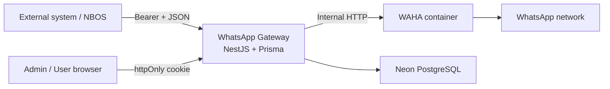

# nbos-whatsapp-gateway

Standalone **WhatsApp Gateway** for sending outbound WhatsApp messages via [WAHA](https://github.com/devlikeapro/waha).  
External systems (for example **NBOS**) integrate with a JSON API using **Gateway URL**, **API token**, **WhatsApp `chatId`**, plus **text** (`POST /api/messages/send`) or **image/video by public HTTPS URL** (`POST /api/messages/send-media`).

This project is **not** NBOS, **not** a plugin, and **not** a Messenger UI.

## What this is

- HTTP JSON API: `POST /api/messages/send` (`chatId` + `text` only), `POST /api/messages/send-media` (`chatId`, `mediaType`, `mediaUrl`, optional `caption`), and group lifecycle under `/api/groups*` (list/create/get/refresh/participants/invite-link), all with `Authorization: Bearer <token>`.
- Minimal **dashboard** (server-rendered) for users/admins: login, WhatsApp connection (QR), session actions, API token lifecycle, safe health.
- **One user → many WhatsApp accounts → one WAHA session each.** API tokens belong to a specific account.

## What this is not

- No chat list, inbox, message history, groups UI, or webhook log UI.
- No storage of message text, captions, or `mediaUrl` in the database (safe metadata logs only, including `messageType`: TEXT / IMAGE / VIDEO).
- No phone-number send path: only WhatsApp `chatId` (`@c.us` / `@g.us`).
- No modification of message text (no name prefix, no signatures).

## Architecture



Public exposure: **Gateway only** (HTTPS). WAHA stays on the Docker internal network.

## Tech stack

- **NestJS** + **TypeScript** (strict)
- **Prisma** + **PostgreSQL** (Neon)
- **argon2id** (dashboard passwords), **HMAC-SHA256** with `TOKEN_PEPPER` (API tokens)
- **Handlebars** dashboard (no SPA)
- **Docker** + **docker-compose** (Gateway + WAHA + persistent WAHA volume)

## Quick start (local)

1. Copy [`.env.example`](.env.example) to `.env` and fill all variables (secrets ≥ 32 chars).
2. Create a Neon database and set `DATABASE_URL`.
3. Install and migrate:

```bash
npm install
npx prisma migrate deploy
npm run prisma:seed   # requires ADMIN_EMAIL / ADMIN_PASSWORD / ADMIN_NAME in .env
npm run start:dev
```

4. Open `http://localhost:3000/login`, sign in as the seeded admin, create users, scan QR, create API tokens.

## Environment

See [`.env.example`](.env.example). Required variables are validated at startup; the process exits with a clear error if anything is missing.

## Docker

```bash
docker compose build
docker compose up -d
```

The bundled WAHA service uses **`devlikeapro/waha:noweb`** with **`WHATSAPP_DEFAULT_ENGINE=NOWEB`**. For **multiple WhatsApp accounts** (WAHA Plus / multi-session), leave **`WAHA_SESSION_NAME` unset** so each account uses its own DB `sessionName`. Only set **`WAHA_SESSION_NAME=default`** for legacy single-session WAHA Core. **Text** sending is the primary verified path; **image/video** via `POST /api/messages/send-media` depends on engine/version/tier and must be validated separately (see [docs/WAHA_SETUP.md](docs/WAHA_SETUP.md)).

See [docs/DEPLOYMENT.md](docs/DEPLOYMENT.md) for Hetzner + reverse proxy guidance.

## External API (summary)

- **Text:** `POST /api/messages/send` — `Authorization: Bearer <API_TOKEN>`, JSON `{ "chatId", "text" }` only.
- **Media:** `POST /api/messages/send-media` — same auth, JSON `{ "chatId", "mediaType": "IMAGE" | "VIDEO", "mediaUrl": "https://...", "caption?": "..." }`. **Media delivery depends on WAHA engine, image tag, and tier** (Core NOWEB is not claimed for production image/video until separately tested). When supported, WAHA downloads the URL and sends real media (the URL is never sent as plain text).
- **Groups:** `GET|POST /api/groups`, `POST /api/groups/refresh`, `GET /api/groups/:groupId`, participants list/add, invite-link — see [docs/API.md](docs/API.md). Create/add require `Idempotency-Key`.

Full contract: [docs/API.md](docs/API.md).

### Example client (NBOS / any service)

```ts
async function sendWhatsappMessage(chatId: string, text: string) {
  const response = await fetch(`${process.env.WHATSAPP_GATEWAY_URL}/api/messages/send`, {
    method: 'POST',
    headers: {
      'Content-Type': 'application/json',
      Authorization: `Bearer ${process.env.WHATSAPP_GATEWAY_TOKEN}`,
    },
    body: JSON.stringify({
      chatId,
      text,
    }),
  });

  const result = await response.json();

  if (!response.ok || !result.success) {
    throw new Error(result.error?.message || 'Failed to send WhatsApp message');
  }

  return result.data;
}
```

Image and video helpers (same auth; `mediaUrl` must be a **public HTTPS** URL) are in [docs/NBOS_INTEGRATION.md](docs/NBOS_INTEGRATION.md).

## Documentation

| Doc | Purpose |
|-----|---------|
| [docs/API.md](docs/API.md) | Public send API, errors, curl |
| [docs/NBOS_INTEGRATION.md](docs/NBOS_INTEGRATION.md) | What NBOS needs (URL + token + chatId + text or media URL) |
| [docs/DEPLOYMENT.md](docs/DEPLOYMENT.md) | Hetzner, Docker, HTTPS, Neon |
| [docs/SECURITY.md](docs/SECURITY.md) | Tokens, cookies, WAHA isolation |
| [docs/WAHA_SETUP.md](docs/WAHA_SETUP.md) | WAHA container, API key, sessions volume |
| [docs/OPERATIONS.md](docs/OPERATIONS.md) | Runbook, health, backups |

## Testing

```bash
npm test
npm run test:e2e
```

## License

Proprietary / internal — adjust as needed.
